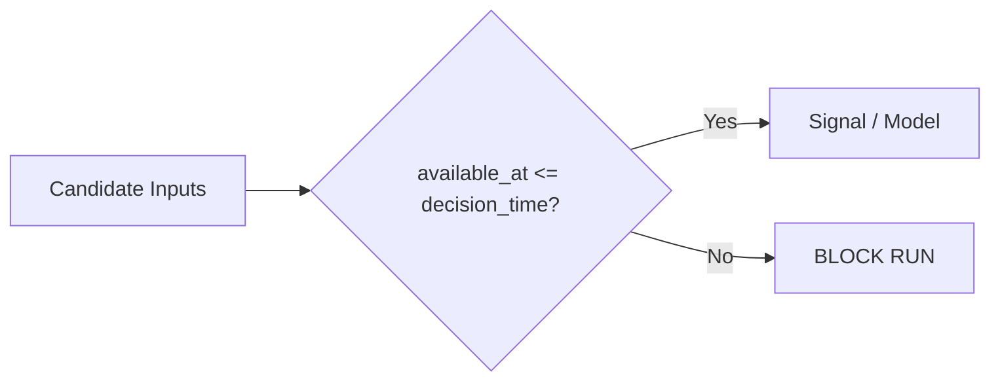
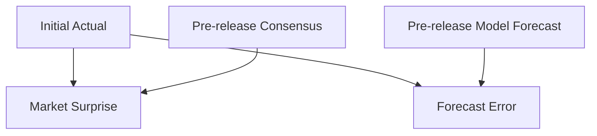
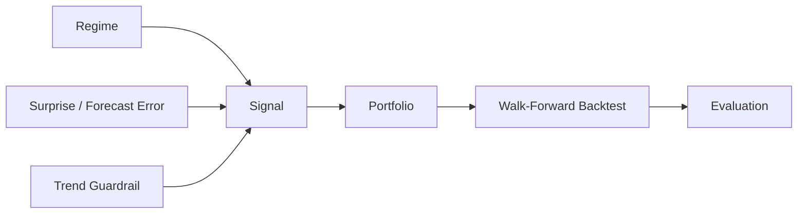

# Diagrams

## Point-in-Time Gate

```mermaid
flowchart LR
    X[Candidate Inputs] --> G{available_at <= decision_time?}
    G -->|Yes| M[Signal / Model]
    G -->|No| B[BLOCK RUN]
```

## Surprise Modes

```mermaid
flowchart TD
    A[Initial Actual] --> S1[Market Surprise]
    C[Pre-release Consensus] --> S1

    A --> S2[Forecast Error]
    F[Pre-release Model Forecast] --> S2
```

## Strategy Research

```mermaid
flowchart LR
    R[Regime] --> S[Signal]
    U[Surprise / Forecast Error] --> S
    T[Trend Guardrail] --> S
    S --> P[Portfolio]
    P --> B[Walk-Forward Backtest]
    B --> E[Evaluation]
```
